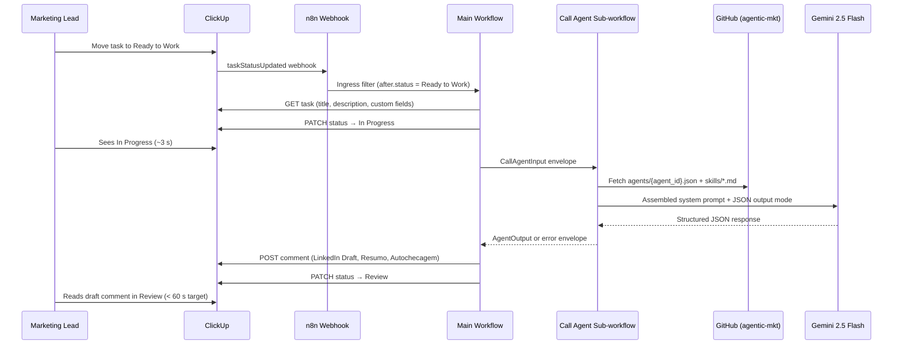

# Call Agent I/O Contract

M1 harness contract between n8n orchestration and the worker agent. Type definitions live in TechSpec **Core Interfaces**; this document is the operator-facing reference for task_06 (Call Agent sub-workflow) and task_07 (Marketing Pipeline main workflow).

## Call Agent sub-workflow contract

| Direction | Shape | Notes |
|-----------|-------|-------|
| **Input** | `CallAgentInput` | Passed by the main workflow when executing the sub-workflow |
| **Output (success)** | `AgentOutput` | Parsed Gemini JSON; validated against [`output-schema.json`](output-schema.json) |
| **Output (parse failure)** | Error envelope | `{ "error": string, "raw_response": string }` — see [Error envelope](#error-envelope) |

**Idempotency:** None in M1 ([ADR-001](../.compozy/tasks/marketing-pipeline-clickup-n8n/adrs/adr-001.md)). Duplicate webhook deliveries may produce duplicate ClickUp comments. Phase 2 adds ingress dedup.

## Input (`CallAgentInput`)

The main workflow maps ClickUp task fields into this envelope before calling the sub-workflow.

| Field | Type | Source | Description |
|-------|------|--------|-------------|
| `agent_id` | string | ClickUp custom field `agent_id` | Runtime config filename stem (e.g. `linkedin-writer` → `agents/linkedin-writer.json`) |
| `task_title` | string | ClickUp task title | Brief headline for the deliverable |
| `task_description` | string | ClickUp task description | Full creative brief body |
| `criterios_de_aceite` | string | ClickUp custom field `Critérios de Aceite` | Acceptance criteria the agent must satisfy in `autochecagem` |

Example:

```json
{
  "agent_id": "linkedin-writer",
  "task_title": "Launch post for Q3 product update",
  "task_description": "Announce the new dashboard feature...",
  "criterios_de_aceite": "- Mention the dashboard\n- CTA to sign up\n- Under 300 words"
}
```

## Output (`AgentOutput`)

Required Gemini response shape after the Code node parses JSON from the model response.

| Field | Type | Description |
|-------|------|-------------|
| `deliverable_markdown` | string | Full LinkedIn post draft in markdown |
| `resumo` | string | 2–3 sentence summary of the draft |
| `autochecagem` | string | Bullet list validating the draft against acceptance criteria |

Field semantics match `output_schema` in [`agents/linkedin-writer.json`](../agents/linkedin-writer.json) (source of truth for M1 worker agent). The harness [`output-schema.json`](output-schema.json) mirrors those keys for validation and documentation — do not duplicate the full agent config here.

Example:

```json
{
  "deliverable_markdown": "## Hook\n\nWe shipped...",
  "resumo": "Short summary of the post angle and CTA.",
  "autochecagem": "- Dashboard mentioned\n- Sign-up CTA present\n- Word count within limit"
}
```

## Error envelope

When the Code node cannot parse valid `AgentOutput` JSON from Gemini:

```json
{
  "error": "Failed to parse AgentOutput: ...",
  "raw_response": "<verbatim model text>"
}
```

| Field | Type | Purpose |
|-------|------|---------|
| `error` | string | Human-readable parse/validation failure reason |
| `raw_response` | string | Unmodified model output for operator troubleshooting |

**Behavior:**

- The Call Agent sub-workflow **returns** the error envelope instead of `AgentOutput`.
- The main workflow **must not silently fail** — on error envelope, log in n8n Executions and surface failure to the operator (TechSpec **Integration Points**). Do not post a partial or empty ClickUp comment.
- Operators diagnose via n8n execution logs: check `error`, inspect `raw_response` for malformed JSON or missing keys.

## ClickUp task comment format

The main workflow posts this markdown template after a successful sub-workflow run. Placeholders map directly to `AgentOutput` fields.

```markdown
## LinkedIn Draft

{deliverable_markdown}

---

## Resumo

{resumo}

---

## Autochecagem

{autochecagem}

---
_Generated by {agent_id} ({model})_
```

| Section | Source field | Notes |
|---------|--------------|-------|
| LinkedIn Draft | `deliverable_markdown` | Primary deliverable for human review |
| Resumo | `resumo` | Quick scan for reviewers |
| Autochecagem | `autochecagem` | Self-check against `criterios_de_aceite` |
| Footer | workflow metadata | `{agent_id}` from input; `{model}` from loaded agent config |

See TechSpec **Data Models → ClickUp task comment format** for the canonical template.

## M1 green run evidence

Anchors from the M1 green run validation (task_08). Committed scaffold: [`green-run-evidence.json`](green-run-evidence.json). Live run output goes to `logs/green-run/<timestamp>/evidence.json` (gitignored — see [`logs/README.md`](../logs/README.md)). Run:

```bash
python3 clickup/green_run_validation.py          # preflight only → logs/
GREEN_RUN_EXECUTE=1 python3 clickup/green_run_validation.py   # after infra ready
GREEN_RUN_UPDATE_CANONICAL=1 ...                 # promote run into green-run-evidence.json for commit
```

**Current `validation_status`:** `blocked` (see preflight blockers in JSON). Update this section after a successful production run sets `main_workflow.verified: true`.

| Metric | Value |
|--------|-------|
| **Validation status** | blocked — operator setup required |
| **Preflight coverage** | 28.6% (2/7 infra checks passing) |
| **Main workflow n8n execution ID** | _(pending green run)_ |
| **Call Agent sub-workflow execution ID** | _(pending green run)_ |
| **ClickUp task URL** | _(pending green run)_ |
| **End-to-end latency** | _(pending — target < 60 s)_ |
| **Status path** | Ready to Work → In Progress → Review |
| **Marketing lead usability** | pending — run green run after operator setup |
| **Silent failures** | _(pending green run)_ |

**Operator blockers (2026-06-22 preflight):**

1. Create **Marketing Pipeline** ClickUp list with M1 statuses and custom fields per [`clickup/list-schema.md`](../clickup/list-schema.md) (current `CLICKUP_LIST_ID` points at **Linkedin Post Creator**, which lacks required fields).
2. Run `python3 clickup/sync-field-mapping.py` and commit updated `field-mapping.json`.
3. Bind ClickUp + Gemini credentials on imported n8n workflows; activate **Marketing Pipeline**; register ClickUp webhook.
4. Re-run `GREEN_RUN_EXECUTE=1 python3 clickup/green_run_validation.py` and record execution ID + task URL here.

**Failure observations (best-effort M1):**

- **Missing Critérios de Aceite:** workflow still runs; autochecagem quality may suffer — brief gate is manual only ([`clickup/list-schema.md`](../clickup/list-schema.md)).
- **Duplicate webhook:** second delivery may produce a duplicate comment per ADR-001; no dedup in M1.

## Workflow sequence expectations

What the marketing lead and operator should observe on a successful run (TechSpec **Integration Tests** green run checklist):



| Step | Timing | Visible to lead | n8n node (main workflow) |
|------|--------|-----------------|---------------------------|
| 1 | T+0 s | Task in Ready to Work | ClickUp Webhook receives payload |
| 2 | T+1–3 s | Status → In Progress | GET ClickUp Task → Extract Task Fields → Status → In Progress |
| 3 | T+3–60 s | (In Progress) | Execute Call Agent → Format Draft Comment → POST Task Comment |
| 4 | T+<60 s | Comment with three sections | Status → Review |

**Provider note (ADR-005):** M1 uses **Gemini 2.5 Flash** via the n8n Gemini node. The PRD originally specified Claude Sonnet 4.6. Phase 2 may swap providers by changing `provider` and `model` in `agents/{agent_id}.json` without restructuring workflows — evaluate draft quality during Phase 2 planning.

## Troubleshooting

Actionable diagnostics for common M1 failure modes. Primary diagnostic surface: **n8n Executions** at `n8n.wolven.com.br` (TechSpec **Monitoring and Observability**).

### Webhook not reaching n8n

**Symptoms:** Task stays in Ready to Work; no new execution in n8n; ClickUp webhook log shows failed or no delivery.

**Diagnostic steps:**

1. Confirm the **Marketing Pipeline** main workflow is **Active** in n8n (inactive workflows do not register production webhooks).
2. Copy the production webhook URL from the **ClickUp Webhook** node — must be `https://n8n.wolven.com.br/webhook/marketing-pipeline-ready-to-work` (not the test URL unless using **Listen for test event**).
3. In ClickUp → Integrations → Webhooks, verify the endpoint URL matches exactly (no trailing slash mismatch).
4. Check ClickUp webhook delivery log for HTTP status codes (401/403/404/502 indicate credential, path, or host issues).
5. **Simulate without ClickUp:** open the webhook node → **Listen for test event** → POST [`clickup/fixtures/task-status-updated-ready-to-work.json`](../clickup/fixtures/task-status-updated-ready-to-work.json) to the test URL. If this succeeds but production fails, the ClickUp registration is wrong — re-register with the production URL.
6. Verify ingress filter: payload must have `history_items[0].field === "status"` and `history_items[0].after.status === "Ready to Work"` ([`clickup/webhook-contract.md`](../clickup/webhook-contract.md)). Transitions *from* Ready to Work to other statuses are ignored.

### Task stuck in In Progress

**Symptoms:** Status changed to In Progress but no comment appeared; task never reached Review.

**Diagnostic steps:**

1. Open **n8n → Executions** and find the run for this task (filter by workflow **Marketing Pipeline**, sort by time).
2. Check execution status: **Error** (red) vs **Success** (green) vs **Running** (stuck).
3. Walk the node sequence per TechSpec happy path: **Ready to Work?** → **GET ClickUp Task** → **Extract Task Fields** → **Status → In Progress** → **Execute Call Agent** → **Format Draft Comment** → **POST Task Comment** → **Status → Review**.
4. If failed at **Execute Call Agent**, open the sub-workflow execution (ID often one less than main — see [green run evidence](#m1-green-run-evidence)). Check **Parse Agent Output** for `parse_success: false` or error envelope.
5. If failed at **GET ClickUp Task** or **POST Task Comment**, re-bind the ClickUp credential and verify the token has access to the Marketing Pipeline list.
6. If **Running** for > 120 s, check Gemini node timeout and GitHub fetch retries (max 2). Cancel stale execution and retry after fixing credentials.
7. Confirm task was not manually moved out of In Progress during the run — partial runs leave the task in In Progress with no comment.

### Gemini JSON parse failures

**Symptoms:** n8n execution errors at **Agent Parse Failure** or **Parse Agent Output**; task stays In Progress; no ClickUp comment.

**Diagnostic steps:**

1. In the Call Agent sub-workflow execution, open **Parse Agent Output** node output.
2. If output is `{ "error": "...", "raw_response": "..." }` (error envelope), inspect `raw_response`:
   - Markdown fences around JSON → Code node should strip; if not, check Gemini JSON output mode is enabled.
   - Missing keys (`deliverable_markdown`, `resumo`, `autochecagem`) → model returned partial JSON; tighten system prompt or reduce `max_output_tokens`.
   - Non-JSON text → disable conversational preamble in Gemini node settings.
3. Check structured log fields: `parse_success: false`, `execution_id`, `agent_id`.
4. Main workflow **Agent Parse Failure** node throws with logged `error` — execution must **not** post a partial comment or advance to Review (TechSpec **Integration Points**).
5. **Isolation test:** run **Manual Trigger (Isolation Test)** on Call Agent sub-workflow per [`n8n/README.md`](../n8n/README.md#sub-workflow-isolation-test-procedure) before debugging the main workflow.

### Field ID mismatches

**Symptoms:** **Extract Task Fields** returns empty `criterios_de_aceite` or wrong `agent_id`; agent runs with blank acceptance criteria; ClickUp API errors on PATCH/POST.

**Diagnostic steps:**

1. Open [`clickup/field-mapping.json`](../clickup/field-mapping.json) — `clickup_field_id` values must not be `<TBD>`.
2. Re-sync from ClickUp API:
   ```bash
   export CLICKUP_API_TOKEN="pk_..."
   export CLICKUP_LIST_ID="your_list_id"
   python3 clickup/sync-field-mapping.py
   ```
3. Run `python3 clickup/verify-api.py` and `python3 -m unittest tests.test_task_04_clickup -v`.
4. In n8n **Extract Task Fields** Code node, confirm expressions reference `field-mapping.json` IDs, not hardcoded stale values.
5. Re-import main workflow JSON after updating `field-mapping.json` if the builder embeds IDs at export time: `python3 n8n/scripts/build_marketing_pipeline_workflow.py`.
6. Verify custom field **names** in ClickUp UI match exactly: `Critérios de Aceite` (with accent), `agent_id`, `revision_count`.

## Reusable harness patterns

Portable patterns for Wolven client projects using the same n8n + GitHub agent config harness. Reference TechSpec sections by name; do not duplicate node configurations here.

### 1. Sub-workflow Contract Pattern

**When to use:** Any orchestrator (n8n main workflow, future MCP server) needs to invoke an LLM worker without coupling to ClickUp or delivery channels.

**Description:** Extract agent invocation into a **pure sub-workflow** that accepts `CallAgentInput` and returns `AgentOutput` or an error envelope. No side effects (no ClickUp writes, no webhooks). Main workflow owns all external I/O.

| Artifact | Reference |
|----------|-----------|
| Input/output types | This doc — [Input](#input-callagentinput), [Output](#output-agentoutput), [Error envelope](#error-envelope) |
| Sub-workflow export | [`n8n/workflows/call-agent-subworkflow.json`](../n8n/workflows/call-agent-subworkflow.json) |
| Isolation test | [`n8n/README.md`](../n8n/README.md#sub-workflow-isolation-test-procedure) |
| TechSpec | **Core Interfaces**, **Call Agent sub-workflow** |

### 2. Status Flow Pattern

**When to use:** Human-in-the-loop pipelines where the GUI (ClickUp) shows progress and the orchestrator mutates status at defined gates.

**Description:** Webhook ingress on a single status (`Ready to Work`) triggers processing. Orchestrator sets **In Progress** before long-running work and **Review** only after successful delivery. Failures leave the task in In Progress with a visible n8n error — never silent.

| Artifact | Reference |
|----------|-----------|
| Status definitions | [`clickup/list-schema.md`](../clickup/list-schema.md) |
| Webhook filter | [`clickup/webhook-contract.md`](../clickup/webhook-contract.md) |
| Main workflow | [`n8n/workflows/marketing-pipeline-main.json`](../n8n/workflows/marketing-pipeline-main.json) |
| TechSpec | **Integration Tests** green run checklist |

### 3. Brief Gate Pattern

**When to use:** Agent quality depends on structured input; automated gates are deferred but human discipline must be documented.

**Description:** Require title, description, and **Critérios de Aceite** before moving to **Ready to Work**. V1 enforcement is manual (lead self-check); n8n may still run if fields are empty. Acceptance criteria flow into `CallAgentInput.criterios_de_aceite` and appear in output `autochecagem`.

| Artifact | Reference |
|----------|-----------|
| Field schema | [`clickup/list-schema.md`](../clickup/list-schema.md) |
| Operational checklist | [`clickup/README.md`](../clickup/README.md#4-brief-gate-operational) |
| PRD | F2 — Brief gate requirements |

### 4. GitHub Runtime Config Pattern

**When to use:** Agent prompts and skills must be version-controlled independently of workflow JSON and loaded at execution time.

**Description:** Store `agents/{id}.json` and `agents/skills/*.md` in a private GitHub repo. Call Agent sub-workflow fetches via n8n GitHub node (read-only PAT). Agent JSON `provider` + `model` fields enable Phase 2 provider swaps without workflow restructure.

| Artifact | Reference |
|----------|-----------|
| Agent schema | [`agents/README.md`](../agents/README.md) |
| Skill copy procedure | [`agents/README.md`](../agents/README.md#skill-copy-procedure-from-skill-vault) |
| ADR | [ADR-004](../.compozy/tasks/marketing-pipeline-clickup-n8n/adrs/adr-004.md) |
| TechSpec | **Agent runtime config**, **GitHub load paths** |

## Related artifacts

| Path | Role |
|------|------|
| [`output-schema.json`](output-schema.json) | JSON Schema for `AgentOutput` validation |
| [`green-run-evidence.json`](green-run-evidence.json) | Committed green-run scaffold; promote from `logs/green-run/` after verified run |
| [`agents/linkedin-writer.json`](../agents/linkedin-writer.json) | M1 agent config and `output_schema` descriptions |
| [`../.compozy/tasks/marketing-pipeline-clickup-n8n/_techspec.md`](../.compozy/tasks/marketing-pipeline-clickup-n8n/_techspec.md) | Core Interfaces, sub-workflow contract, integration error handling |
| [`../.compozy/tasks/marketing-pipeline-clickup-n8n/_prd.md`](../.compozy/tasks/marketing-pipeline-clickup-n8n/_prd.md) | F5 harness documentation requirements |
