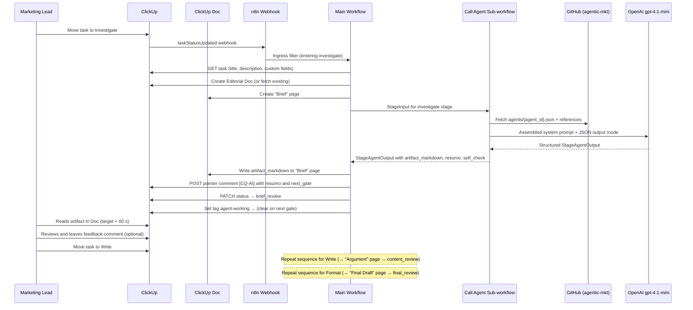

# Call Agent I/O Contract

M1 harness contract between n8n orchestration and the worker agent. Type definitions live in TechSpec **Core Interfaces**; this document is the operator-facing reference for task_06 (Call Agent sub-workflow) and task_07 (Marketing Pipeline main workflow).

## Call Agent sub-workflow contract

| Direction | Shape | Notes |
|-----------|-------|-------|
| **Input** | `CallAgentInput` | Passed by the main workflow when executing the sub-workflow |
| **Output (success)** | `AgentOutput` | Parsed OpenAI JSON; validated against [`output-schema.json`](output-schema.json) |
| **Output (parse failure)** | Error envelope | `{ "error": string, "raw_response": string }` — see [Error envelope](#error-envelope) |

**Idempotency:** None in M1 (ADR-001). Duplicate webhook deliveries may produce duplicate ClickUp comments. Phase 2 adds ingress dedup.

## Input (`StageInput`)

The main workflow maps ClickUp task fields and stage context into this envelope before calling the Call Agent sub-workflow. (M1 names this `CallAgentInput` in code; task 23+ revision uses `StageInput` for consistency with typed stage output.)

| Field | Type | Source | Description |
|-------|------|--------|-------------|
| `stage` | string | n8n node context | Current AI stage: `"investigate"`, `"write"`, or `"format"` |
| `task_id` | string | ClickUp webhook payload | ClickUp task ID for subsequent API calls |
| `task_title` | string | ClickUp task title | Brief headline for the deliverable |
| `task_description` | string | ClickUp task description | Full creative brief body |
| `criterios_de_aceite` | string | ClickUp custom field `ACs` | Acceptance criteria the agent must satisfy in `self_check` |
| `agent_id` | string | ClickUp custom field `Agent` | Runtime config filename stem (e.g. `linkedin-writer` → `agents/linkedin-writer.json`) |
| `prior_page_markdown` | string | ClickUp Doc page read before stage run | Previous stage's artifact markdown (for Write and Format stages that may reference earlier work) |
| `latest_lead_feedback` | string | Latest actionable lead comment | Extracted from task comment thread; guides revision stages |

Example:

```json
{
  "agent_id": "linkedin-writer",
  "task_title": "Launch post for Q3 product update",
  "task_description": "Announce the new dashboard feature...",
  "criterios_de_aceite": "- Mention the dashboard\n- CTA to sign up\n- Under 300 words"
}
```

### Staged input with feedback embedding

All stages after the initial Investigate can incorporate lead feedback. The main workflow passes the latest actionable lead comment in `latest_lead_feedback` instead of embedding it in `task_description`. Agent skills detect feedback presence and incorporate it while maintaining the original brief, acceptance criteria, and Wolven voice.

**When `latest_lead_feedback` is present** (normal for Write and Format stages):
- The stage reads and integrates the feedback into its output
- The artifact uses feedback to refine earlier work without re-deriving from scratch
- The comment thread is preserved as audit trail

## Output (`StageAgentOutput`)

Required OpenAI response shape after the Code node parses JSON from the model response. Structure is consistent across all three stages (investigate, write, format); content differs by stage role.

| Field | Type | Description |
|-------|------|-------------|
| `stage` | string | Which stage produced this output: `"investigate"`, `"write"`, or `"format"` |
| `artifact_markdown` | string | Stage's primary deliverable (Brief / Argument / Final Draft) in markdown |
| `resumo` | string | 2–3 sentence summary of what was produced and why |
| `self_check` | string | Bullet list validating the artifact against acceptance criteria and stage role |
| `next_gate` | string | Which human gate to advance to: `"brief_review"`, `"content_review"`, or `"final_review"` |
| `blocker_question` | string | _(optional)_ If present, the stage encountered missing material and is asking a clarification question instead of producing output |

Field semantics defined in ADR-006 (Use Stage-Aware Agent Contracts) and enforced by stage agent configs (source of truth for each stage's worker agent). The harness [`output-schema.json`](output-schema.json) validates this structure.

Example (Investigate stage):

```json
{
  "stage": "investigate",
  "artifact_markdown": "# Brief\n\n## Topic: Dashboard Feature Launch...",
  "resumo": "Investigated the angle for the dashboard announcement post. Key insight: emphasize how the feature saves marketing teams time.",
  "self_check": "- Topic clear and audience identified\n- Constraints acknowledged\n- Angle is novel",
  "next_gate": "brief_review"
}
```

Example (Blocker):

```json
{
  "stage": "investigate",
  "artifact_markdown": "",
  "resumo": "",
  "self_check": "",
  "next_gate": "",
  "blocker_question": "What is the primary audience for this post? (e.g., product teams, marketing leads, C-suite?)"
}
```

## Error envelope

When the Code node cannot parse valid `AgentOutput` JSON from the model:

```json
{
  "error": "Failed to parse AgentOutput: ...",
  "raw_response": "<verbatim model text>"
}
```

| Field | Type | Purpose |
|-------|------|---------|
| `error` | string | Human-readable parse/validation failure reason |
| `raw_response` | string | Unmodified model output for operator troubleshooting |

**Behavior:**

- The Call Agent sub-workflow **returns** the error envelope instead of `AgentOutput`.
- The main workflow **must not silently fail** — on error envelope, log in n8n Executions and surface failure to the operator (TechSpec **Integration Points**). Do not post a partial or empty ClickUp comment.
- Operators diagnose via n8n execution logs: check `error`, inspect `raw_response` for malformed JSON or missing keys.

## ClickUp task comment format

The main workflow posts this markdown template after a successful stage completes. Pointer comments are prefixed with `[CQ-AI]` (CQ = Content Quality); blocker comments use `[CQ-BLOCKER]`.

**Pointer comment** (stage succeeded, posted when advancing to next human gate):

```markdown
[CQ-AI] **{stage_title} Complete**

## {artifact_page_name}

{artifact_markdown}

---

## Resumo

{resumo}

---

## Self-Check

{self_check}

---

**Next:** {next_gate_display_name}

_Generated by {agent_id} on {stage} ({model})_
```

**Blocker comment** (stage encountered missing material):

```markdown
[CQ-BLOCKER] **{stage_title} Blocked**

## Blocker Question

{blocker_question}

Please answer this question in a comment below, then move the task forward to retry.

_Generated by {agent_id} on {stage} ({model})_
```

| Section | Source field | Notes |
|---------|--------------|-------|
| Artifact page | `artifact_markdown` | The actual Brief / Argument / Final Draft for human review |
| Resumo | `resumo` | Quick summary of what was produced |
| Self-Check | `self_check` | Stage's validation against criteria |
| Next gate | `next_gate` from output | Which human column to advance to (e.g., "Brief Review") |
| Blocker question | `blocker_question` (if present) | Clarification needed before retry |
| Footer | workflow metadata | `{agent_id}` from input; `{model}` from loaded agent config |

**Pointer comment tags** (task 23+ revision, ADR-008):
- `[CQ-AI]` marks a pointer comment (normal progress)
- `[CQ-BLOCKER]` marks a blocker question comment (requires human response before retry)

**Activity tags** (task 23+ revision, ADR-008):
- `agent-working`: Set when a stage begins, cleared when advancing to next gate or returning to previous gate
- `agent-blocked`: Set when a blocker output is detected (swapped from `agent-working`), cleared when the task is moved forward to retry

Tags are visible on ClickUp board cards and provide at-a-glance AI status signaling alongside the column status itself.

## M1 green run evidence

Anchors from the M1 green run validation (task_08). Committed scaffold: [`green-run-evidence.json`](green-run-evidence.json). Live run output goes to `logs/green-run/<timestamp>/evidence.json` (gitignored — see [`logs/README.md`](../../logs/README.md)). Run:

```bash
pnpm vendor:gate                       # exit 0 required before any step below
pnpm green-run                         # preflight only → logs/
GREEN_RUN_EXECUTE=1 pnpm green-run      # after infra ready
GREEN_RUN_UPDATE_CANONICAL=1 pnpm green-run   # promote run into green-run-evidence.json for commit
```

**Current `validation_status`:** `blocked` (see preflight blockers in JSON). Update this section after a successful production run sets `main_workflow.verified: true`.

| Metric | Value |
|--------|-------|
| **Validation status** | blocked — operator setup required |
| **Preflight coverage** | 28.6% (2/7 infra checks passing) |
| **Main workflow n8n execution ID** | _(pending green run)_ |
| **Call Agent sub-workflow execution ID** | _(pending green run)_ |
| **ClickUp task URL** | _(pending green run)_ |
| **End-to-end latency** | _(pending — target < 60 s)_ |
| **Status path** | ready → writing → approval (see [Live status names](#live-clickup-status-names-vs-n8n-node-labels)) |
| **Marketing lead usability** | pending — run green run after operator setup |
| **Silent failures** | _(pending green run)_ |

**Operator blockers (2026-06-22 preflight):**

1. Create **Marketing Pipeline** ClickUp list with M1 statuses and custom fields per [`clickup/list-schema.md`](../../clickup/list-schema.md) (current `CLICKUP_LIST_ID` points at **Linkedin Post Creator**, which lacks required fields).
2. Run `pnpm vendor:gate` then `pnpm clickup:sync` and commit updated `field-mapping.json`.
3. Bind ClickUp + OpenAI credentials on imported n8n workflows; activate **Marketing Pipeline**; register ClickUp webhook.
4. Re-run `GREEN_RUN_EXECUTE=1 pnpm green-run` and record execution ID + task URL here.

**Failure observations (best-effort M1):**

- **Missing ACs:** workflow still runs; autochecagem quality may suffer — brief gate is manual only ([`clickup/list-schema.md`](../../clickup/list-schema.md)).
- **Duplicate webhook:** second delivery may produce a duplicate comment per ADR-001; no dedup in M1.

## Live ClickUp status names vs n8n node labels

[`clickup/field-mapping.json`](../../clickup/field-mapping.json) defines API status strings. n8n node names retain TechSpec labels for operator traceability in Executions.

**Staged workflow statuses** (active production path):

| ClickUp status | `field-mapping.json` key | n8n node | Trigger |
|----------------|--------------------------|----------|---------|
| `investigate` | `statuses.investigate` | **Investigate?** (ingress) | Lead moves task to Investigate |
| `brief_review` | `statuses.brief_review` | **→ Brief Review** | Investigate stage auto-advances |
| `write` | `statuses.write` | **Write?** (ingress) | Lead moves task to Write |
| `content_review` | `statuses.content_review` | **→ Content Review** | Write stage auto-advances |
| `format` | `statuses.format` | **Format?** (ingress) | Lead moves task to Format |
| `final_review` | `statuses.final_review` | **→ Final Review** | Format stage auto-advances |
| `publish` | `statuses.publish` | — | Lead moves to Publish (no AI) |
| `backlog` | `statuses.backlog` | — | Initial state or blocker return |
| `Closed` | `statuses.completed` | — | Terminal state |

**Happy-path transitions:** `backlog → investigate` (ingress) → workflow auto-advances → `brief_review` → lead moves to `write` (ingress) → auto-advances → `content_review` → lead moves to `format` (ingress) → auto-advances → `final_review` → lead moves to `publish` → `Closed`.

**Blocker returns:** any stage can return to its previous gate (e.g., `investigate` → `backlog`, `write` → `brief_review`, `format` → `content_review`) if blocker output is detected.

**Rework re-runs:** lead can move a task back to an earlier AI column to re-run only that stage (e.g., move from `content_review` back to `write` to revise the argument).

**Self-echo executions (expected):** each workflow status PATCH emits another `taskStatusUpdated` webhook (e.g., `investigate → brief_review`). Ingress ignores these because `after.status` is not entering a stage status. They appear as short green n8n runs (~7 ms) — not duplicate pipeline work. See [`clickup/webhook-contract.md`](../../clickup/webhook-contract.md#self-echo-webhooks-expected-noise).

## Workflow sequence expectations

What the marketing lead and operator should observe on a successful staged run (TechSpec **Integration Tests** green run checklist). The workflow repeats this sequence for each of the three stages (Investigate, Write, Format).



| Step | Timing | Visible to lead | n8n node(s) |
|------|--------|-----------------|-------------|
| 1 | T+0 s | Task in Investigate | ClickUp Webhook receives payload |
| 2 | T+1–3 s | Status → Investigate (unchanged) | GET Task → Extract Fields → Create/Fetch Doc → Fetch Prior Pages |
| 3 | T+3–60 s | (Investigate status) | Execute Call Agent → Create/Replace Doc Page |
| 4 | T+<60 s | Pointer comment with Brief artifact and resumo | POST Comment → Status → Brief Review → Add/Clear Tags |
| 5 | T+<60 s | Doc URL in Editorial Doc Url field | (updated during step 2) |
| 6 | ~T+60+ s | Ready to review and provide feedback | Lead reads Doc and comments |
| 7 | T+N (lead moves) | Move to Write triggers stage 2 | Webhook fires again; stage 2 repeats steps 1–5 |

**Provider note (ADR-005):** M1 uses **OpenAI `gpt-4.1-mini`** via the n8n OpenAI Chat Model node (defaults in [`src/call-agent/logic.ts`](../src/call-agent/logic.ts)). The PRD originally specified Claude Sonnet 4.6; an earlier draft used Gemini. Phase 2 may swap providers by changing `provider` and `model` in `agents/{agent_id}.json` without restructuring workflows — evaluate draft quality during Phase 2 planning.

## Proof and green-run exit-code contract

Local verification scripts (`pnpm green-run`, `scripts/content-quality-proof.ts`) enforce a standardized exit-code contract (per ADR-010) so incomplete verification is never silently reported as success.

### Exit-code meanings

| Exit code | Meaning | Next action | Emitted by |
|-----------|---------|-------------|-----------|
| **0** | Fully verified pass | None; ready for production | Both scripts when live verification completes and succeeds |
| **1** | Local check failed | Fix the failing check per stderr message; re-run script | Both scripts when local checks fail |
| **2** | Blocked (missing prerequisite) | Verify infrastructure: credentials, field IDs, workflow deploy status; re-run script | Both scripts when a prerequisite check fails (e.g., ClickUp credentials, n8n workflow status) |
| **3** | Ready but unverified | Run with live credentials to verify: `GREEN_RUN_EXECUTE=1 pnpm green-run` | `pnpm green-run` only, when preflight checks pass but live workflow execution not run |

**Important:** Exit code **3** (ready/unverified) is *not* a success. It means preflight checks pass and the codebase is structurally valid, but the workflow has not been exercised end-to-end. Use exit code 3 to distinguish "the code looks good locally" from "the code works in production."

### Failure output format

On any non-zero exit, both scripts print:
- Failing check ID (e.g., `A6`, `A13`)
- Human-readable failure message
- Concrete remediation step

Example stderr on local failure:

```
[FAIL] A6: ClickUp field ID validation
       Field 'editorial_doc_url' has ID <TBD> (not synced from live list)
       → Run: pnpm clickup:sync
```

Example stderr on preflight-only (exit 3):

```
[READY] Preflight checks passed. Live execution not run.
[PHASE] Skipped: Phase 2 (Call Agent workflow)
[PHASE] Skipped: Phase 3 (ClickUp document creation)
[ACTION] To verify live behavior, run: GREEN_RUN_EXECUTE=1 pnpm green-run
```

## Troubleshooting

Actionable diagnostics for common M1 failure modes. Primary diagnostic surface: **n8n Executions** at `n8n.wolven.com.br` (TechSpec **Monitoring and Observability**).

### Webhook not reaching n8n

**Symptoms:** Task moved to a stage but no new execution in n8n; ClickUp webhook log shows failed or no delivery.

**Diagnostic steps:**

1. Confirm the **Marketing Pipeline** main workflow is **Active** in n8n (inactive workflows do not register production webhooks).
2. Copy the production webhook URL from the **ClickUp Webhook** node — must be `https://n8n.wolven.com.br/webhook/marketing-pipeline-staged-ingress` (not the test URL unless using **Listen for test event**).
3. In ClickUp → Integrations → Webhooks, verify the endpoint URL matches exactly (no trailing slash mismatch).
4. Check ClickUp webhook delivery log for HTTP status codes (401/403/404/502 indicate credential, path, or host issues).
5. **Simulate without ClickUp:** open the webhook node → **Listen for test event** → POST a staged ingress fixture to the test URL (e.g., `clickup/fixtures/task-status-updated-investigate.json` for the Investigate stage). If this succeeds but production fails, the ClickUp registration is wrong — re-register with the production URL.
6. Verify ingress filter: payload must have `history_items[0].field === "status"` and be **entering** one of `investigate`, `write`, or `format` per [`field-mapping.json`](../../clickup/field-mapping.json) ([`clickup/webhook-contract.md`](../../clickup/webhook-contract.md)). Transitions such as `investigate → brief_review` are self-echo and correctly ignored.

### Task stuck with agent-working

**Symptoms:** Task has the `agent-working` tag but no pointer or blocker comment appeared; task never reached the next gate.

**Diagnostic steps:**

1. Open **n8n → Executions** and find the run for this task (filter by workflow **Marketing Pipeline**, sort by time).
2. Check execution status: **Error** (red) vs **Success** (green) vs **Running** (stuck).
3. Walk the staged node sequence: **GET ClickUp Task** → **Extract Task Fields** → stage IF (**Investigate?**, **Write?**, or **Format?**) → **Add agent-working** → **GET Task Comments** → **Collect Task Comments** → **Read Current Page** → **Execute Call Agent** → pointer/blocker comment handling.
4. If failed at **Execute Call Agent**, open the sub-workflow execution (ID often one less than main — see [green run evidence](#m1-green-run-evidence)). Check **Parse Agent Output** for `parse_success: false` or error envelope.
5. If failed at **GET ClickUp Task** or **POST Task Comment**, re-bind the ClickUp credential and verify the token has access to the Marketing Pipeline list.
6. If **Running** for > 120 s, check OpenAI node timeout and GitHub fetch retries (max 2). Cancel stale execution and retry after fixing credentials.
7. Confirm task was not manually moved out of the stage during the run — partial runs can leave the `agent-working` tag with no comment.

### OpenAI JSON parse failures

**Symptoms:** n8n execution errors at **Agent Parse Failure** or **Parse Agent Output**; task stays in writing; no ClickUp comment.

**Diagnostic steps:**

1. In the Call Agent sub-workflow execution, open **Parse Agent Output** node output.
2. If output is `{ "error": "...", "raw_response": "..." }` (error envelope), inspect `raw_response`:
   - Markdown fences around JSON → Code node should strip; if not, check OpenAI JSON output mode is enabled.
   - Missing keys (`deliverable_markdown`, `resumo`, `autochecagem`) → model returned partial JSON; tighten system prompt or reduce `max_output_tokens`.
   - Non-JSON text → disable conversational preamble in OpenAI node settings.
3. Check structured log fields: `parse_success: false`, `execution_id`, `agent_id`.
4. Main workflow **Agent Parse Failure** node throws with logged `error` — execution must **not** post a partial comment or advance to approval (Status → Review).
5. **Isolation test:** run **Manual Trigger (Isolation Test)** on Call Agent sub-workflow per [`n8n/README.md`](../../n8n/README.md#sub-workflow-isolation-test-procedure) before debugging the main workflow.

### Field ID mismatches

**Symptoms:** **Extract Task Fields** returns empty `criterios_de_aceite` or wrong `agent_id`; agent runs with blank acceptance criteria; ClickUp API errors on PATCH/POST.

**Diagnostic steps:**

1. Open [`clickup/field-mapping.json`](../../clickup/field-mapping.json) — `clickup_field_id` values must not be `<TBD>`.
2. Re-sync from ClickUp API (`pnpm clickup:sync`, the TypeScript successor to the original `sync-field-mapping.py` script):
   ```bash
   export CLICKUP_API_TOKEN="pk_..."
   export CLICKUP_LIST_ID="your_list_id"
   pnpm vendor:gate
   pnpm clickup:sync
   ```
3. Run `pnpm clickup:verify` and `pnpm test tests/clickup.test.ts`.
4. In n8n **Extract Task Fields** Code node, confirm expressions reference `field-mapping.json` IDs, not hardcoded stale values.
5. Re-import main workflow JSON after updating `field-mapping.json` if the builder embeds IDs at export time: `pnpm build:workflows`.
6. Verify custom field **names** in ClickUp UI match exactly: `ACs`, `Agent`.

## Reusable harness patterns

Portable patterns for Wolven client projects using the same n8n + GitHub agent config harness. Reference TechSpec sections by name; do not duplicate node configurations here.

### 1. Sub-workflow Contract Pattern

**When to use:** Any orchestrator (n8n main workflow, future MCP server) needs to invoke an LLM worker without coupling to ClickUp or delivery channels.

**Description:** Extract agent invocation into a **pure sub-workflow** that accepts `CallAgentInput` and returns `AgentOutput` or an error envelope. No side effects (no ClickUp writes, no webhooks). Main workflow owns all external I/O.

| Artifact | Reference |
|----------|-----------|
| Input/output types | This doc — [Input](#input-callagentinput), [Output](#output-agentoutput), [Error envelope](#error-envelope) |
| Sub-workflow export | [`marketing-pipelines/call-agent-subworkflow.json`](../../marketing-pipelines/call-agent-subworkflow.json) |
| Isolation test | [`n8n/README.md`](../../n8n/README.md#sub-workflow-isolation-test-procedure) |
| TechSpec | **Core Interfaces**, **Call Agent sub-workflow** |

### 2. Status Flow Pattern

**When to use:** Human-in-the-loop pipelines where the GUI (ClickUp) shows progress and the orchestrator mutates status at defined gates.

**Description:** Webhook ingress when entering a work stage triggers processing. Orchestrator sets `agent-working` before long-running work and advances the task to the next gate only after successful delivery. Failures leave a visible n8n error and the task tagged for investigation.

| Artifact | Reference |
|----------|-----------|
| Status definitions | [`clickup/list-schema.md`](../../clickup/list-schema.md) |
| Webhook filter | [`clickup/webhook-contract.md`](../../clickup/webhook-contract.md) |
| Main workflow | [`marketing-pipelines/marketing-pipeline-main.json`](../../marketing-pipelines/marketing-pipeline-main.json) |
| TechSpec | **Integration Tests** green run checklist |

### 3. Brief Gate Pattern

**When to use:** Agent quality depends on structured input; automated gates are deferred but human discipline must be documented.

**Description:** Require title, description, and **ACs** before moving to **ready**. V1 enforcement is manual (lead self-check); n8n may still run if fields are empty. Acceptance criteria flow into `CallAgentInput.criterios_de_aceite` and appear in output `autochecagem`.

| Artifact | Reference |
|----------|-----------|
| Field schema | [`clickup/list-schema.md`](../../clickup/list-schema.md) |
| Operational checklist | [`clickup/README.md`](../../clickup/README.md#4-brief-gate-operational) |
| PRD | F2 — Brief gate requirements |

### 4. GitHub Runtime Config Pattern

**When to use:** Agent prompts and skills must be version-controlled independently of workflow JSON and loaded at execution time.

**Description:** Store `agents/{id}.json` and `agents/skills/*.md` in a private GitHub repo. Call Agent sub-workflow fetches via n8n GitHub node (read-only PAT). Agent JSON `provider` + `model` fields enable Phase 2 provider swaps without workflow restructure.

| Artifact | Reference |
|----------|-----------|
| Agent schema | [`agents/README.md`](../README.md) |
| Skill copy procedure | [`agents/README.md`](../README.md#skill-copy-procedure-from-skill-vault) |
| ADR | ADR-004 |
| TechSpec | **Agent runtime config**, **GitHub load paths** |

## Related artifacts

| Path | Role |
|------|------|
| [`output-schema.json`](output-schema.json) | JSON Schema for `AgentOutput` validation |
| [`green-run-evidence.json`](green-run-evidence.json) | Committed green-run scaffold; promote from `logs/green-run/` after verified run |
| [`linkedin-writer.json`](../linkedin-writer.json) | M1 agent config and `output_schema` descriptions |
| TechSpec (local, gitignored — `.compozy/tasks/marketing-pipeline-clickup-n8n/_techspec.md`) | Core Interfaces, sub-workflow contract, integration error handling |
| PRD (local, gitignored — `.compozy/tasks/marketing-pipeline-clickup-n8n/_prd.md`) | F5 harness documentation requirements |
